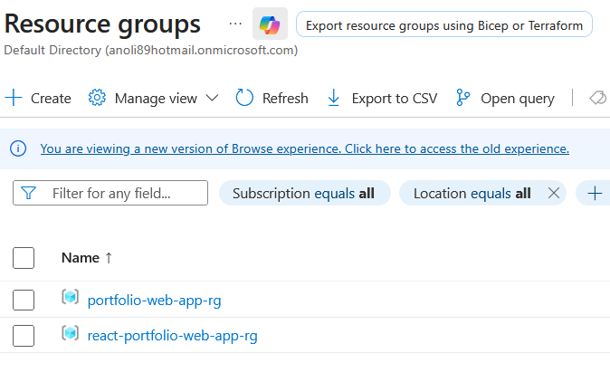
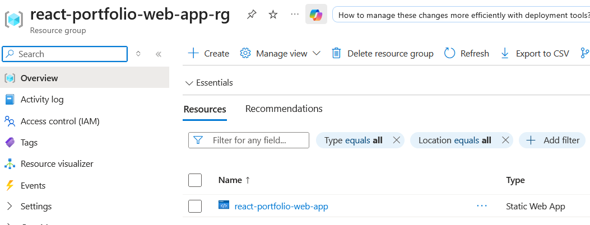
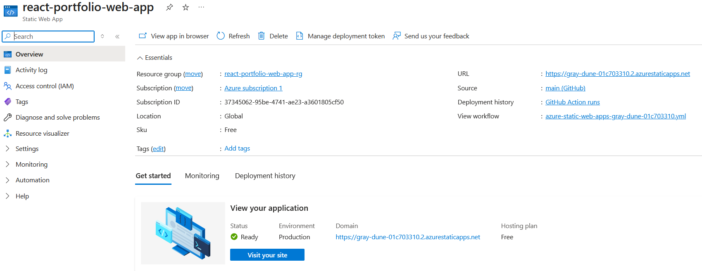
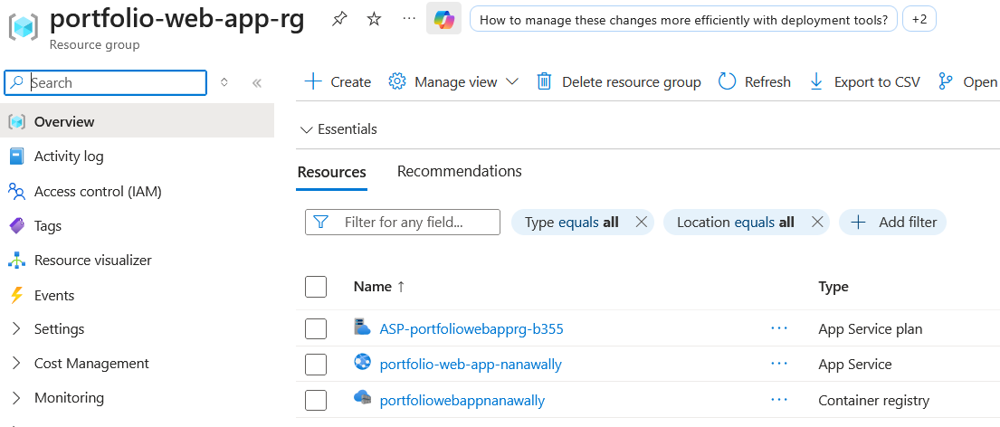
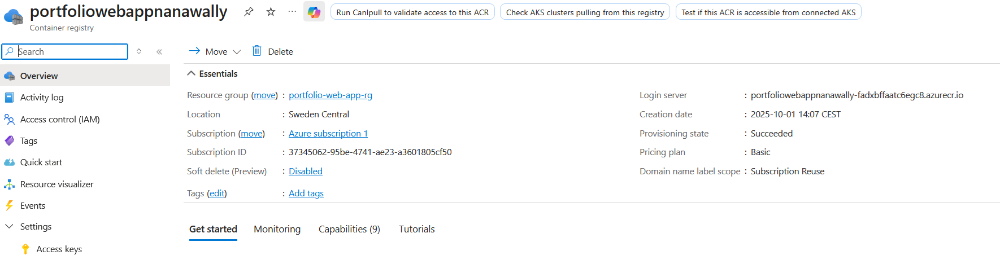
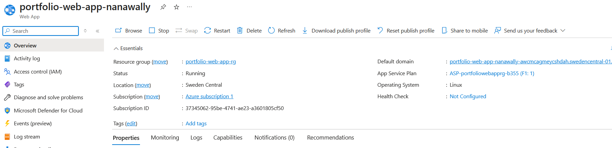

# Portfolio Web Application

## Overview

This is a personal portfolio web application built with React and TypeScript using the Vite build tool. The project showcases different aspects of my portfolio such as About, Contact, CV, and Tech. It was created as part of a school project to demonstrate modern deployment workflows using Azure.

The app has been deployed in two different ways:
- As a **Static Web App** using GitHub Actions
- As a **Dockerized App** deployed via Azure App Service using Azure Container Registry

## Development Process

The project was created using Vite with React and TypeScript. Existing HTML and CSS content from an older project was migrated into reusable React components.

### Azure Static Web App

- Connected to a GitHub repository.
- Automatically builds and deploys on `main` branch changes using GitHub Actions.
- Hosted via Azure Static Web Apps.

### Azure App Service (Docker)

- App is containerized using a Dockerfile.
- Image is built locally and pushed to Azure Container Registry (ACR).
- Azure App Service is configured to pull the container image from ACR and deploy it automatically.

## Screenshots
### Resource groups for static web app & dockerized web app

### View of static web app in Azure portal

### View of static web app in Azure portal

### View of resource group that contains both container registry and app service

### View of container registry in Azure portal

### View of dockerized app service in Azure portal

## Technologies Used

- React + TypeScript
- Vite
- Docker
- Azure Static Web Apps
- Azure Container Registry (ACR)
- Azure App Service
- GitHub Actions (CI/CD)
